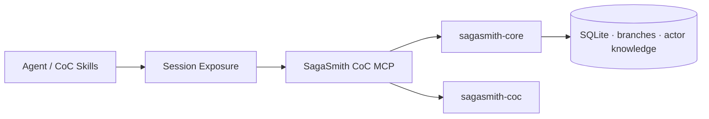

# SagaSmith CoC MCP

[中文](README.md) · [English](README-en.md) · [平台总览](https://github.com/SagaSmithAI/.github/blob/main/profile/README.md)

**SagaSmithAI 的 Call of Cthulhu 7e 本地 MCP 服务。** 它把 `sagasmith-core` 的战役、分支记忆、角色知识、Snapshot 与模组能力，以及 `sagasmith-coc` 的 d100、SAN、战斗和追逐判定，收敛到一个可被任何 MCP Agent 使用的服务端边界。

## 为什么是独立 MCP

- **状态归 MCP 所有**：SQLite 与导入产物都位于 `.sagasmith-coc-mcp/`，不依赖某个 Agent 的工作目录。
- **Exposure 在服务端**：每个原生 MCP session 独立维护已加载原生工具、TTL 与 Lobby/Play/Combat 阶段，不要求 Agent 复制工具分类。
- **角色知识真正隔离**：PC、NPC、怪物的 belief/rumor/false belief 分别按 actor 与 branch 保存；玩家只能读取或修改被授权角色。
- **判定与写状态分离**：`coc_resolve` 返回规则结算；角色卡、SAN、HP 或战役状态必须通过显式写工具提交，避免“调用检查就偷偷改卡”。
- **Keeper 信息不外泄**：玩家的模组索引与搜索只返回 `visibility=player` 的 handout 场景。



## 工具阶段

服务端为每个工具保存唯一的阶段、角色、是否需要战役和是否仅限本机策略。Agent 通过一个 `exposure` facade 搜索并增删需要的原生工具；阶段或恢复操作变化时，服务端裁剪非法工具并发送 `tools/list_changed`。

Agent 首次只会看到目录级核心工具。标准流程是：

```text
exposure(open) → exposure(search) → exposure(set) → native domain tool
```

Host 必须支持原生动态工具列表刷新；不再提供固定全集、文本模拟或 `exposure_call` fallback。

## 快速开始

```bash
pip install -e "../sagasmith-core[documents]"
pip install -e ../sagasmith-coc
pip install -e .
sagasmith-coc-mcp
```

默认状态目录：`./.sagasmith-coc-mcp/`。可用 `SAGASMITH_COC_MCP_HOME` 指定路径，并用 `SAGASMITH_COC_SKILLS_DIR`、`SAGASMITH_MODULEGEN_SKILLS_DIR` 接入 Skills 生态。

## 安全边界

- 创建战役时创建 owner membership；新增玩家需 Keeper 显式 grant campaign 与 actor。
- owner/DM 可管理全部角色；玩家只能访问明确授权的 actor private state。
- Exposure 同时绑定 MCP session、principal、campaign 与阶段，不能跨会话或跨战役复用。
- `combat.active=true` 时进入 Combat；非 Keeper 不能直接写角色卡，以免绕过判定与行动边界。
- 商业规则书和模组不随仓库发布；仅导入你有权使用的内容。

## 开发

```bash
pip install -e ".[dev]"
pytest
ruff check .
```

原创代码使用 Apache-2.0。Call of Cthulhu 及相关商业内容归其权利人所有。
